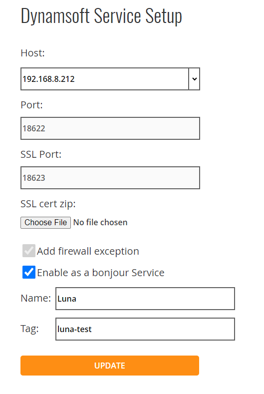

# Configure Bonjour Service

Enable Bonjour Service for the computer (with Dynamsoft Service installed) which has scanner connected to make it discoverable by other users on the Intranet. 

1.	Access <a href="http://127.0.0.1:18625" target="_blank">http://127.0.0.1:18625</a>   

2.	Set Host IP. If your IP is not listed, enter it manually. Port and SSL Port cannot be modified.

4. [Optional] Import SSL cet zip. You can import Dynamsoft certificate or your own certificates.

5. [Optional] ‘Add firewall exception’ is selected by default. On Windows, it will be added automatically. On macOS and Linux, administrators need to set them up manually.

6.	Select ‘Enable as a Bonjour Service’.  
  - Name. You can set the name to distinguish other Bonjour Services. 
  - Tag. Optional setting.   

7.	Click UPDATE.

### <a href="{{site.proxy}}" target="_blank">Next</a>

