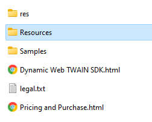
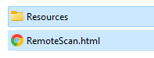
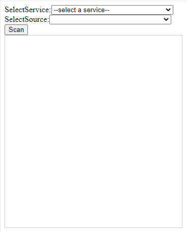
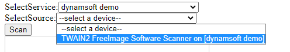
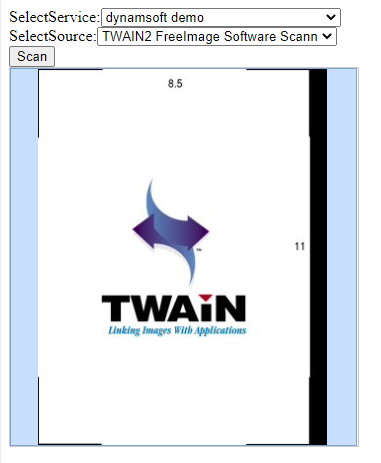

# Build a Remote Scan Page

> Before you start, please make sure you've downloaded and installed the v18.x `Dynamic Web TWAIN`. If you haven't done so, you can get the 30-day free trial installer [here](https://www.dynamsoft.com/Downloads/WebTWAIN_Download.aspx).

The following steps show you how to create your remote scan application in a few minutes!

## Start a Web Application

Create a `remotescan.html` anywhere and copy the `Resources` folder to the same location. You can typically find this folder in `C:\Program Files (x86)\Dynamsoft\Dynamic Web TWAIN SDK {Version Number}\`
* Resources



* The project

 

## Include the library

Embed the script of the library and add a `div` element for the library on the page.

``` html
<script src="Resources/dynamsoft.webtwain.config.js"></script>
<script src="Resources/dynamsoft.webtwain.initiate.js"></script>
```

``` html
<div id="dwtcontrolContainer" style="width: 350px; height: 380px;"></div>
```

> Width and height can be changed.

## Write remote scan code

Create remote scan object and get list of Dynamsoft Services with Bonjour Service enabled from Proxy Service.

``` html
<div>SelectService:<select size="1" id="selServices" style="position: relative; width: 240px;" onchange="selectedServices();"></select></div>
<div>SelectSource:<select size="1" id="selDevices" style="position: relative; width: 240px;"></select></div>

<script type="text/javascript">

    var DWRemoteScanObject, allServices, allDevices;
    var serverurl = 'https://demo.scannerproxy.com'; // A public proxy server provided by Dynamsoft. You can also change to your own proxy server.

    Dynamsoft.DWT.CreateRemoteScanObjectAsync(serverurl)
      .then(function (rsObject) {
        DWRemoteScanObject = rsObject;

        var element = document.getElementById("dwtcontrolContainer");
        DWRemoteScanObject.Viewer.bind(element); // Bind viewer
        DWRemoteScanObject.Viewer.show(); // Show viewer

        return DWRemoteScanObject.getDynamsoftService();
      })
      .then(function (services) {
        allServices = services;
        var ddlService = document.getElementById("selServices");
        if (ddlService) {
          ddlService.options.length = 0;
          ddlService.options.add(new Option("--select a service--", "-1"));
          for (var i = 0; i < services.length; i++) {
            var serverInfo = services[i];
            if (serverInfo.attrs.name.length > 0)
              ddlService.options.add(new Option(serverInfo.attrs.name, i));
            else ddlService.options.add(new Option(serverInfo.attrs.UUID, i));
          }
          ddlService.selectedIndex = 0;
        }
      })
      .catch(function (exp) {
        console.error(exp);
      });

    function selectedServices() {
      var ddlService = document.getElementById("selServices");
      if (ddlService.selectedIndex >= 0 && allServices && allServices.length > 0) {
        var devicetype =
          Dynamsoft.DWT.EnumDWT_DeviceType.TWAINSCANNER |
          Dynamsoft.DWT.EnumDWT_DeviceType.WIASCANNER |
          Dynamsoft.DWT.EnumDWT_DeviceType.TWAINX64SCANNER |
          Dynamsoft.DWT.EnumDWT_DeviceType.ICASCANNER |
          Dynamsoft.DWT.EnumDWT_DeviceType.SANESCANNER |
          Dynamsoft.DWT.EnumDWT_DeviceType.ESCLSCANNER |
          Dynamsoft.DWT.EnumDWT_DeviceType.WIFIDIRECTSCANNER;
        DWRemoteScanObject.getDevices({
          serviceInfo: allServices[ddlService.selectedIndex - 1],
          deviceType: devicetype,
        })
          .then(function (devices) {
            allDevices = devices;
            var ddlDevice = document.getElementById("selDevices");
            if (ddlDevice) {
              ddlDevice.options.length = 0;
              ddlDevice.options.add(new Option("--select a device--", "-1"));
              for (var i = 0; i < devices.length; i++) {
                var device = devices[i];
                if (device.displayName.length > 0)
                  ddlDevice.options.add(new Option(device.displayName, i));
                else ddlDevice.options.add(new Option(device.name, i));
              }
              ddlDevice.selectedIndex = 0;
            }
          })
          .catch(function (exp) {
            console.error(exp);
          });
      }
    }

</script>
```

## Write code to scan 

Add a scan button and the minimum code.

``` html
<input type="button" value="Scan" onclick="AcquireImage();" />
<script type="text/javascript">
    function AcquireImage() {
      if (DWRemoteScanObject) {
        var selDevices = document.getElementById("selDevices");
        if (selDevices) {
          if (selDevices.selectedIndex - 1 >= 0) {
            DWRemoteScanObject.acquireImage(
              allDevices[selDevices.selectedIndex - 1],
              {
                IfCloseSourceAfterAcquire: true, // Scanner source will be closed automatically after the scan.
              }
            ).catch(function (exp) {
              alert(exp.message);
            });
          }
        }
      }
    }
</script>
```


## Review the complete code

``` html
<html>

<head>
  <title>Hello World</title>
    <script src="Resources/dynamsoft.webtwain.config.js"></script>
    <script src="Resources/dynamsoft.webtwain.initiate.js"></script>
</head>

<body>
	<div>SelectService:<select size="1" id="selServices" style="position: relative; width: 240px;" onchange="selectedServices();"></select></div>
	<div>SelectSource:<select size="1" id="selDevices" style="position: relative; width: 240px;"></select></div>
  <div><input type="button" value="Scan" onclick="AcquireImage();" /></div>
  <div id="dwtcontrolContainer" style="width: 350px; height: 380px;"></div>
  <script type="text/javascript">
    var DWRemoteScanObject, allServices, allDevices;
    var serverurl = 'https://demo.scannerproxy.com'; // A public proxy server provided by Dynamsoft. You can also change to your own proxy server.

    Dynamsoft.DWT.CreateRemoteScanObjectAsync(serverurl)
      .then(function (rsObject) {
        DWRemoteScanObject = rsObject;

        var element = document.getElementById("dwtcontrolContainer");
        DWRemoteScanObject.Viewer.bind(element); // viewer bind element xxx
        DWRemoteScanObject.Viewer.show(); // viewer show

        return DWRemoteScanObject.getDynamsoftService();
      })
      .then(function (services) {
        allServices = services;
        var ddlService = document.getElementById("selServices");
        if (ddlService) {
          ddlService.options.length = 0;
          ddlService.options.add(new Option("--select a service--", "-1"));
          for (var i = 0; i < services.length; i++) {
            var serverInfo = services[i];
            if (serverInfo.attrs.name.length > 0)
              ddlService.options.add(new Option(serverInfo.attrs.name, i));
            else ddlService.options.add(new Option(serverInfo.attrs.UUID, i));
          }
          ddlService.selectedIndex = 0;
        }
        //if(allServices.length > 0)
        //DWRemoteScanObject.setDefaultDynamsoftService(allServices[0]);
      })
      .catch(function (exp) {
        console.error(exp);
      });

    function selectedServices() {
      var ddlService = document.getElementById("selServices");
      if (ddlService.selectedIndex >= 0 && allServices && allServices.length > 0) {
        var devicetype =
          Dynamsoft.DWT.EnumDWT_DeviceType.TWAINSCANNER |
          Dynamsoft.DWT.EnumDWT_DeviceType.WIASCANNER |
          Dynamsoft.DWT.EnumDWT_DeviceType.TWAINX64SCANNER |
          Dynamsoft.DWT.EnumDWT_DeviceType.ICASCANNER |
          Dynamsoft.DWT.EnumDWT_DeviceType.SANESCANNER |
          Dynamsoft.DWT.EnumDWT_DeviceType.ESCLSCANNER |
          Dynamsoft.DWT.EnumDWT_DeviceType.WIFIDIRECTSCANNER;
        DWRemoteScanObject.getDevices({
          serviceInfo: allServices[ddlService.selectedIndex - 1],
          deviceType: devicetype,
        })
          .then(function (devices) {
            allDevices = devices;
            var ddlDevice = document.getElementById("selDevices");
            if (ddlDevice) {
              ddlDevice.options.length = 0;
              ddlDevice.options.add(new Option("--select a device--", "-1"));
              for (var i = 0; i < devices.length; i++) {
                var device = devices[i];
                if (device.displayName.length > 0)
                  ddlDevice.options.add(new Option(device.displayName, i));
                else ddlDevice.options.add(new Option(device.name, i));
              }
              ddlDevice.selectedIndex = 0;
            }
          })
          .catch(function (exp) {
            console.error(exp);
          });
      }
    }

    function AcquireImage() {
      if (DWRemoteScanObject) {
        var selDevices = document.getElementById("selDevices");
        if (selDevices) {
          if (selDevices.selectedIndex - 1 >= 0) {
            DWRemoteScanObject.acquireImage(
              allDevices[selDevices.selectedIndex - 1],
              {
                IfCloseSourceAfterAcquire: true, // Scanner source will be closed automatically after the scan.
              }
            ).catch(function (exp) {
              alert(exp.message);
            });
          }
        }
      }
    }

  </script>
</body>

</html>
```
## See the remote scan page in action

* Open the page in your browser



  > If you see a license notice, please make sure you have a valid trial license. Contact [Dynamsoft Support](https://www.dynamsoft.com/company/customer-service/#contact){:target="_blank"} if you need help.

* Select a service and a scanner source and then press the Scan button



* After scan

    The scanned documents will show up in the page.



## Online Demo 

<a href="https://demo.dynamsoft.com/Samples/dwt/RemoteScan/HelloWorld.html" target="_blank">Online Remote Scan Demo</a>  
