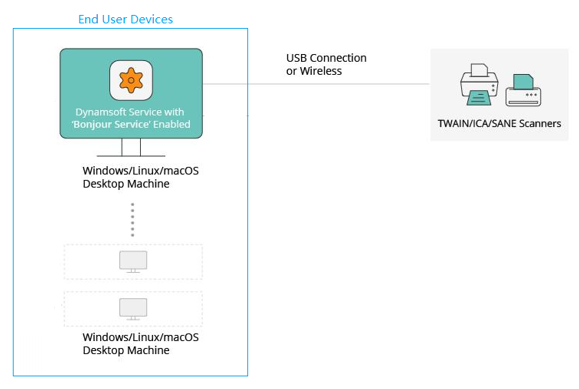
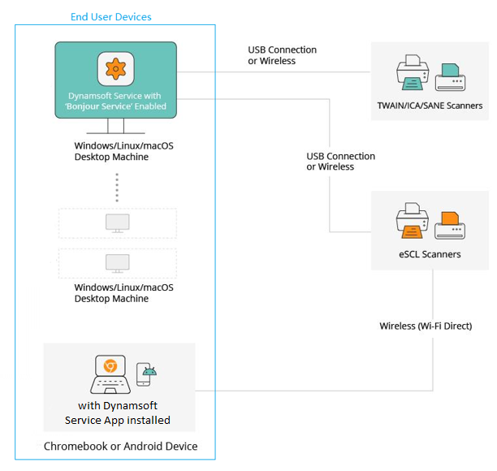

# What is Localhost Scan ？

Before Dynamic Web TWAIN v18.2, document scanning was only supported between an end user computer (with Dynamsoft Service installed) and physical document scanners (TWAIN/ICA/SANE compliant). See the chart below.

Starting in Dynamic Web TWAIN SDK v18.2, we now support a new scanning protocol: the eSCL protocol. In addition, Dynamsoft Service is also available as an Android app to help Android end users scan documents from an eSCL supported scanner to their Chromebook or Android device. See the chart below.

These are **Localhost Scan** solutions that **require every end-user device to install the Dynamsoft Service** to support scanning documents from a physical document scanner connected to the device. 
